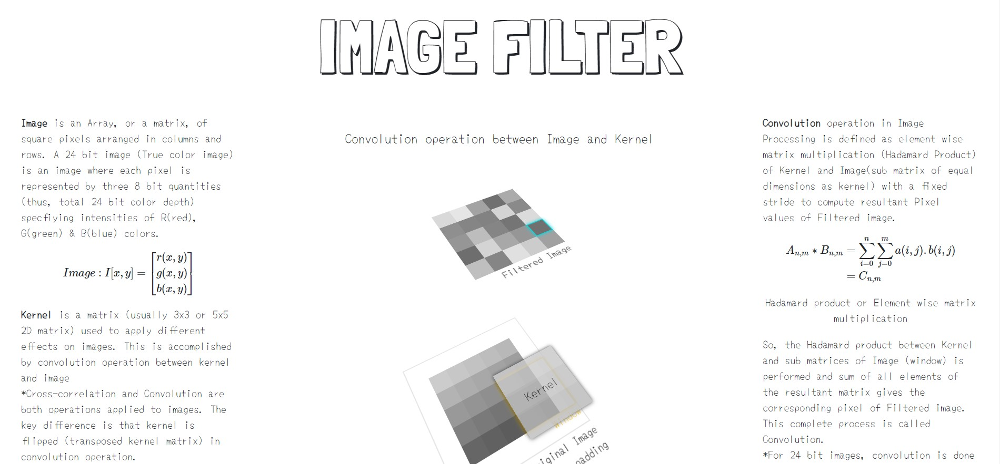
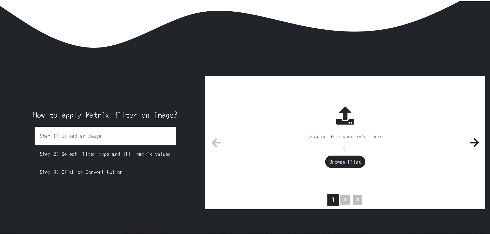

# Image Filter

Click [here](https://image-filter-001-app.herokuapp.com/) to try it now.

> If the site does not load on first attempt then either refresh the page or try again to access the link. It is because the site with low traffic on Heroku is pulled down to save server usage

## About

Image filter based on convolution of Kernel (2D) and Image matrix.

- Frontend made with HTML, CSS/SCSS, JavaScript and jQuery.
- Backend made with Flask framework and used Jinja2 for templating.
- Used OpenCV for applying convolution and numpy for image interpretation & manipulation.
- Deployed the complete project on Heroku.

There are different affects that can be applied on images like -

- Blur
- Emboss
- Sharpen
- Motion Blur
- Edge Highlight

These affects can mathematically be expressed as a 2D Matrix (Kernel) and by performing convolution with Image matrix (also represented as a 2D Matrix).

